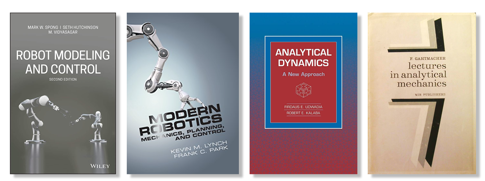

<!-- ### **References** -->

The material of this course is based on techniques which, in my humble opinion, are theoretically interesting and practically significant. This in no way means that the proposed algorithms are the recipe for resolving all your control problems.

### Hand books

Some content of this course is described in the following text books:

### Online materials
* [Control Bootcamp](https://www.youtube.com/playlist?list=PLMrJAkhIeNNR20Mz-VpzgfQs5zrYi085m) - YouTube playlist on the concepts of linear and nonlinear control
* [Data Driven Dynamical Systems and Control](http://www.databookuw.com/) - the online text book and collection of short videos on data driven control and engenering 
* [Underactuated Robotis](https://underactuated.mit.edu/) - the perfect course on MIT about numerical methods in control.
* [Slotine control course](https://www.bilibili.com/video/BV1yb411e7t5/) - personally my favourite course on nonlinear control

