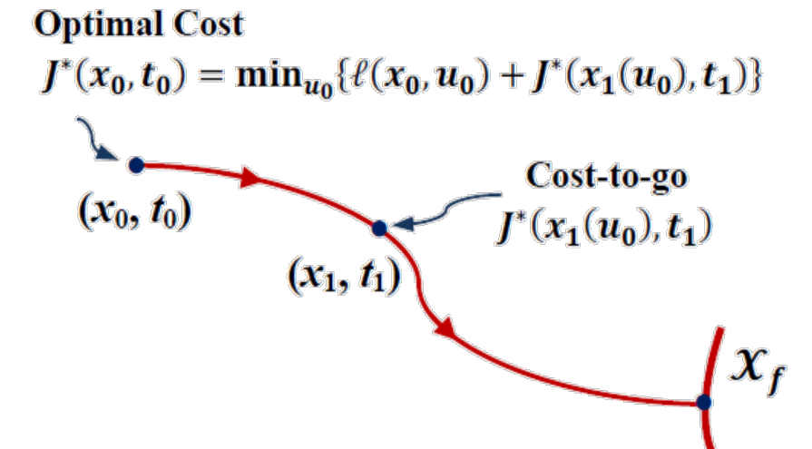
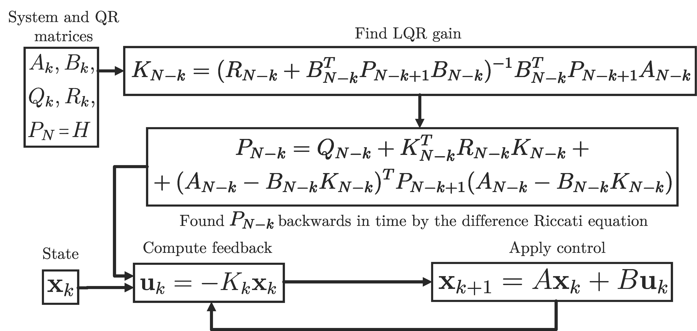
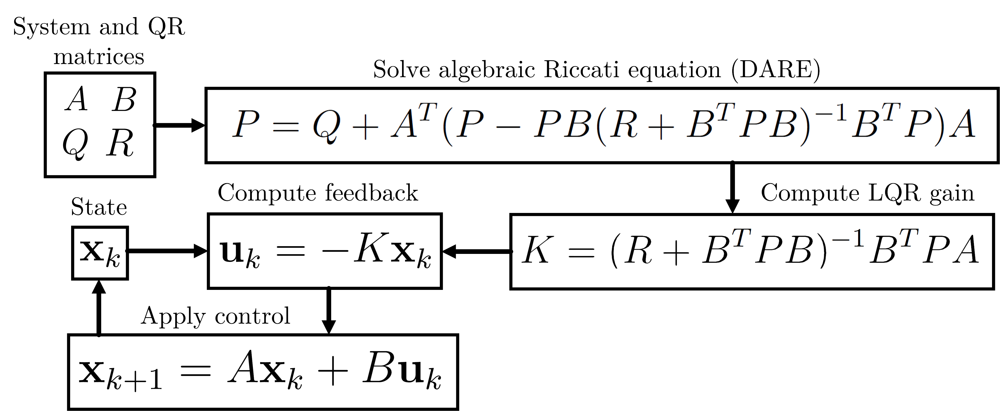

## **Modern Control Paradigms:**
### **Lecture 4: Introduction to Optimal Control, Dynamic Programming and Linear Quadratic Regulator, RoA and Funnels**


In the previous classes, we discussed about the design of state feedback
control for a linear dynamical system.
For an LTI system, we can place the closed-loop eigenvalues of the
controlled system at any desired locations if the system is controllable. Following some basic guidelines in eigenvalue placement, we can ensure that the controlled system **IS STABLE** and **likely** has some
desired characteristics but the resulting controller may not be the best
possible one. 


### **Control as Optimization** 

In practice we may desire to:
* tune response for the particular parts of state
* preserving less control effort 
All of this is nearly not possible or challenging to do with just pole placement, it is the time for optimization to come into the game. 

The big idea is to formulate the control problem as optimization, and then choose the input $\mathbf{u}$ to the system such that it **operates in some best possible sense** based on a **mathematically-defined performance criterion**.

### **Cost Function** 

In order to solve our problem using optimal control we define a **scalar function which map the control action  $\mathbf{u}(\mathbf{x}, t)$ (sometimes refereed as policy) to  performance of our system**. We call such function cost function (sometimes - value, performance or even reward).

In the optimal control settings we usually stick to so called additive cost: 

$$
\mathcal{J}(\mathbf{x}(t_0), \mathbf{u}, t_0) = \int^{t_f}_{t_0}\ell(\mathbf{x}(t), \mathbf{u}(t), t)dt + h(\mathbf{x}(t_f),t_f)
$$

or its discrete version:
$$
\mathcal{J}(\mathbf{x}_n, \mathbf{u}, n) = \sum^{N}_{k=n}\ell(\mathbf{x}_k, \mathbf{u}_k, k) + h(\mathbf{x}_N,N)
$$

where $\ell(\cdot)$ and $h(\cdot)$ are stage and terminal costs respectively


The definition above is fairly general, and may be used to formulate vast variety of practical control problems, for instance:

* **Minimum time** : $h = t_f$, such that $\mathbf{x}(t_f) = x_f$, $\mathbf{u}(t) \in \mathcal{U}$
* **Minimal effort** : $\ell = \| u(t)\|$, such that $\mathbf{x}(t_f) = x_f$
* **State/effort tradeoff** : $\ell = \mathbf{x}(t)^T\mathbf{Q}(t)\mathbf{x}(t) + \mathbf{u}(t)^T\mathbf{R}(t)\mathbf{u}(t)$, with terminal cost $h = \mathbf{x}(t_f)^T\mathbf{P}\mathbf{x}(t_f)$


Let us start with discrete dynamics and slightly simplified version of the cost:

$$
\mathcal{J}(\mathbf{x}_n, \mathbf{u}) = \sum^{N}_{k=n}\ell(\mathbf{x}_k, \mathbf{u}_k)
$$


Let us now rewrite this as follows:

$$
\mathcal{J}(\mathbf{x}_n, \mathbf{u}) = \ell(\mathbf{x}_n, \mathbf{u}_n) + \sum^{N}_{k=n+1}\ell(\mathbf{x}_k, \mathbf{u}_k)
$$


Which is equavalient to:
$$
\mathcal{J}(\mathbf{x}_n, \mathbf{u}) = \ell(\mathbf{x}_n, \mathbf{u}_n) + \mathcal{J}(\mathbf{x}_{n+1}, \mathbf{u})  
$$

Now letting the discrite dynamics to be represented as: 

$$
\mathbf{x}_{k+1} = \mathbf{f}(\mathbf{x}_k, \mathbf{u}_k)
$$


Now suppose that somebody provided us with the optimal cost starting from the point $\mathbf{x}_{n+1}$, 

$$
\min _{u}\mathcal{J}(\mathbf{x}_{n+1}, \mathbf{u}) = \mathcal{J}^*(\mathbf{x}_{n+1}) = \mathcal{J}^*(\mathbf{f}(\mathbf{x}_n, \mathbf{u}_n))
$$


Now minimizing the full cost we may arrive to:

$$
\min _{u}\mathcal{J}(\mathbf{x}_{n}, \mathbf{u}) = \mathcal{J}^*(\mathbf{x}_{n}) = \min _{u}\{\ell(\mathbf{x}_n, \mathbf{u}) + \mathcal{J}^*(\mathbf{f}(\mathbf{x}_n, \mathbf{u}))\}
$$


<p align="center">

</p>

### **Dynamic Programming**

One can use the statement above to build the procedure of solving a discrete-time optimal control problem using
DP, in fact is one of the main working horses in reinforement learning, check the simplest application of [grid world](https://cs.stanford.edu/people/karpathy/reinforcejs/gridworld_dp.html)

However is one when the state and input spaces are continuous. For better approximation, the gridding of the state and inputspaces should be fine.


**‘Curse of Dimensionality’** Although we can obtain approximated
numerical solutions to the optimal control problem using the DP method
discussed above, DP computational requirements scale rather badly. As
the system dimension (order) and time horizon $t_f − t_0$ grow, storage
and computational requirements become very high.


For a few cases, we can obtain analytical solutions of the optimal control
problem using the principle of optimality.

## **Discrete-Time LQR**
Consider a discrete-time LRV system described by:

$$
\mathbf{x}_{k+1}=\mathbf{A}_k \mathbf{x}_{k}+\mathbf{B}_k\mathbf{u}_{k}
$$

with a performance index defined as:
$$
J_c(\mathbf{x}_0, \mathbf{u})=\frac{1}{2} \Big[ \sum \limits _{{k=0}}^{{N-1}}\left(\mathbf{x}_{k}^{T}\mathbf{Q}_k\mathbf{x}_{k}+\mathbf{u}_{k}^{T}\mathbf{R}_k\mathbf{u}_{k}\right) + \mathbf{x}_{N}^{T}\mathbf{Q}_N\mathbf{x}_{N} \Big]
$$

where: $\mathbf{x}_{k}^{T}\mathbf{Q}\mathbf{x}_{k}$ penalizes the transient state deviation, $\mathbf{u}_{k}^{T}\mathbf{R}\mathbf{u}_{k}$ penalizes the control effort


The problem is to find the sequence $\mathbf{u} = [\mathbf{u}_0, \mathbf{u}_1, \dots, \mathbf{u}_{N-1}]$ that
minimizes the cost function $J_c(\mathbf{x}_0, \mathbf{u})$

Let us apply the dynamic programming to get the solution of DLQR. Starting from the cost on the last step:

$$
J_c(\mathbf{x}_N) = \mathbf{x}_{N}^{T}\mathbf{Q}_N\mathbf{x}_{N}
$$

Then using principle of optimality:
$$
J^*_{N-1}(\mathbf{x}_{N-1}) = \min _{u}\{\frac{1}{2} \Big[\mathbf{x}_{N-1}^{T}\mathbf{Q}_{N-1}\mathbf{x}_{N-1}+\mathbf{u}_{N-1}^{T}\mathbf{R}_{N-1}\mathbf{u}_{N-1}\Big] + \frac{1}{2} (\mathbf{A}_{N-1} \mathbf{x}_{N-1}+\mathbf{B}_{N-1}\mathbf{u}_{N-1})^{T}\mathbf{Q}_N(\mathbf{A}_{N-1} \mathbf{x}_{N-1}+\mathbf{B}_{N-1}\mathbf{u}_{N-1})\}
$$

To obtain the minimum in the, we find the derivative w.r.t. $\mathbf{u}_{N-1}$ and set it to zero:

$$
(\mathbf{R}_{N-1} + \mathbf{B}^T_{N-1}\mathbf{Q}_N\mathbf{B}_N)\mathbf{u}_{N-1} + \mathbf{B}^T_{N-1}\mathbf{Q}_{N}\mathbf{A}_{N-1}\mathbf{x}_{N-1} =0
$$

This suggests that the optimal control at time $N-1$ is the linear function of state:

$$
    \mathbf{u}_{N-1} = \mathbf{K}_{N-1}\mathbf{x}_{N-1}
$$

with $\mathbf{K}_{N-1} = (\mathbf{R}_{N-1} + \mathbf{B}^T_{N-1}\mathbf{Q}_N\mathbf{B}_N)^{-1}\mathbf{B}^T_{N-1}\mathbf{Q}_{N}\mathbf{A}_{N-1}$ being the feedback gains


Substitution to the cost above yields:
$$
J^*_{N-1}(\mathbf{x}_{N-1}) = \mathbf{x}_{N-1}^{T}\mathbf{Q}_{N-1}\mathbf{x}_{N-1}+\mathbf{x}_{N-1}^{T}\mathbf{K}_{N-1}^{T}\mathbf{R}_{N-1}\mathbf{K}_{N-1}\mathbf{x}_{N-1} + \frac{1}{2} \mathbf{x}_{N-1}^{T}\mathbf{\Phi}_{N-1}^T \mathbf{P}_N \mathbf{\Phi}_{N-1}\mathbf{x}_{N-1}
$$

Which can be written in form of:
$$
J^*_{N-1}(\mathbf{x}_{N-1}) = \frac{1}{2}\mathbf{x}_{N-1}^{T}\mathbf{P}_{N-1}\mathbf{x}_{N-1}
$$

$\mathbf{P}_{N-1} = \mathbf{Q}_{N-1}+\mathbf{K}_{N-1}^{T}\mathbf{R}_{N-1}\mathbf{K}_{N-1} + \mathbf{\Phi}_{N-1}^T \mathbf{P}_N \mathbf{\Phi}_{N-1}$

### **Discrete-time Time-Varying LQR Algorithm**

Proceeding recursively we arrive to the following recursive algorithm.

Given $k \in \{0,1,2,\dots, N-1 \}$:

$$
\mathbf{K}_k = (\mathbf{R}_{k} + \mathbf{B}^T_{k}\mathbf{P}_{k+1}\mathbf{B}_k)^{-1}\mathbf{B}^T_{k}\mathbf{P}_{k+1}\mathbf{A}_{k}
$$

$$
\mathbf{P}_{k} = \mathbf{Q}_{k}+\mathbf{K}_{k}^{T}\mathbf{R}_{k}\mathbf{K}_{k} + (\mathbf{A}_k - \mathbf{B}_k\mathbf{K}_k)^T \mathbf{P}_{k+1} (\mathbf{A}_k - \mathbf{B}_k\mathbf{K}_k)
$$

where $\mathbf{P}_{N} = \mathbf{Q}$ 

Then the controller is given as time varying linear feedback:
$$
    \mathbf{u}_k = -\mathbf{K}_{k}\mathbf{x}_k
$$

Note that matrices are calculated offline and independent on the state  


<p align="center">

</p>

It is worth noting that the recursion of cost to go maybe obtained without calculating feedback gains as:

$$
\mathbf{P}_k = \mathbf{Q}_k + \mathbf{A}_k^T(\mathbf{P}_{k+1} - \mathbf{P}_{k+1}\mathbf{B}_k(\mathbf{R}_k + \mathbf{B}_k^T\mathbf{P}_{k+1}\mathbf{B}_k)^{-1}\mathbf{B}_k^T\mathbf{P}_{k+1})\mathbf{A}_k
$$


```python
import numpy as np

def dlqr_ltv(A, B, Q, R):
    '''Discrete time LTV LQR controller'''
    N = np.shape(A)[0]
    n = np.shape(A)[1]
    m = np.shape(B)[2]

    # Matrix to store cost-to-go
    P = np.zeros((N, n, n))
    P[0] = Q[-1]
    # Matrix to store gains
    K = np.zeros((N, m, n))

    for k in range(N-1, -1):
        # Compute the LQR gain
        invM_k = np.linalg.inv((R[k] + B[k].T @ P[k+1] @ B[k]))
        K[k] = invM_k @ B[k].T @ P[k+1] @ A[k]
        Ac_k = A[k] - B[k] @ K[k]   # Update with difference Riccati equation
        # Compute cost-to-go matrix
        P[k] = Q[k] + K[k].T @ R[k] @ K[k] + Ac_k @ P[k+1] @ Ac_k
    return K, P

```

### **Discrete-time LTI LQR Algorithm, DARE**

Consider the time-invariant LQR problem with $\mathbf{A}_t = \mathbf{A}$, $\mathbf{B}_t = \mathbf{B}$, $\mathbf{Q}_t = \mathbf{Q}$ and $\mathbf{R}_t = \mathbf{R}$, then for stabilizable $\{\mathbf{A},\mathbf{B}\}$ and $N\rightarrow \infty$ (infinite horizon) the LQR cost-to-go recursion is converging to constant p.d. $\mathbf{P}$ that sitisfy:  

$$
\mathbf{P} = \mathbf{Q} + \mathbf{A}^T(\mathbf{P} - \mathbf{P}\mathbf{B}(\mathbf{R} + \mathbf{B}^T\mathbf{P}\mathbf{B})^{-1}\mathbf{B}^T\mathbf{P})\mathbf{A}
$$


This is known as **Discrete-Time Algebraic Riccati Equation (DARE)**. A solution to the DARE may not be necessarily unique! 


```python
from scipy.linalg import solve_discrete_are as dare
```

Once the solution of **DARE** is obtained one may design the feedback controller as in LTV case as:

$$
\mathbf{u}_k = - (\mathbf{R} + \mathbf{B}^T \mathbf{P} \mathbf{B})^{-1}\mathbf{B}^T\mathbf{P}\mathbf{A}\mathbf{x}_k=-\mathbf{K}\mathbf{x}_k 
$$

And the resulting closed loop system $\mathbf{A} - \mathbf{B}\mathbf{K}$ is stable. 


```python
def dlqr(A, B, Q, R):
    '''Discrete time LTI LQR'''
    # Solve discrete Ricatti equation (DARE)
    P = dare(A, B, Q, R)
    # Compute the LQR gain
    K = np.linalg.inv(B.T @ P @ B + R) @ (B.T @ P @ A)
    return K, P

```

<p align="center">

</p>

**Exercise:** 

Find the analytical expression of LQR feedback gain in terms of $Q, R$ for following scalar system:
$$
x_{k+1} = x_k + u_k
$$

### **Stabilization of Nonlinear Systems and Region of Attraction**

The LQR techique can be applied to stabilize the nonlinear systems in the same way as we did in pole-placement design, consider:
$$
\dot{\mathbf{x}} = \mathbf{f}(\mathbf{x}, \mathbf{u})
$$

With linearization given by:

$$
\dot{\tilde{\mathbf{x}}} = 
\frac{\partial\mathbf{f}}{\partial\mathbf{x}}\Bigr\rvert_{\mathbf{x}_d,\mathbf{u}_d} 
\tilde{\mathbf{x}} + 
\frac{\partial\mathbf{f}}{\partial\mathbf{u}}\Bigr\rvert_{\mathbf{x}_d,\mathbf{u}_d} 
\tilde{\mathbf{u}} =
\mathbf{A}
\tilde{\mathbf{x}} + 
\mathbf{B} 
\tilde{\mathbf{u}}
$$


The operating point is found similarly to equilibrium of: $\mathbf{f}(\mathbf{x}_d, \mathbf{u}_d) = 0$

Now one can find descritization of the linearized system to get:
$$
\tilde{\mathbf{x}}_{k+1} = 
\mathbf{A}_d
\tilde{\mathbf{x}}_k + 
\mathbf{B}_d 
\tilde{\mathbf{u}}_k
$$

and solve DARE to get $\mathbf{P}$ and the feedback gains $\mathbf{K}$ which can be used for feedback:
$$
\mathbf{u}_k = \mathbf{u}_{d_k} - \mathbf{K}\tilde{\mathbf{x}}_k
$$

However as in the case of pole placement you will apply controller not to the linear system which you used to approximate dynamics of actual plant, but to nonlinear one, resulting in following discrite dynamics (assuming small $T$):

$$
 \mathbf{x}_{k+1} = \mathbf{x}_k + T\mathbf{f}(\mathbf{x}_k, \mathbf{u}_{d_k} - \mathbf{K}\tilde{\mathbf{x}}_k)
$$

Thus the closed loop response may be drastically different and even unstable!


**Example**: Follow [this link](https://colab.research.google.com/drive/1HtwXMTESG5IDhD2Zo40m-ME3aJJxX9K-#scrollTo=H608E584MQst) to get the example LTI LQR control design to perform the orbital maneuver.


The LQR algorithm have one interesting artifact, it produce the cost-to-go matrix that can be used to build the Lyapunov candidate:

$$
V(\mathbf{x}_k) = \frac{1}{2}\mathbf{x}^T_k \mathbf{P} \mathbf{x}_k
$$

That can be further used for region of attraction analysis! 

To do so in case of discrete systems we may use a slightly different version of Lyapunov theory, by looking for the largest region:
$$
\{\mathbf{x}_k: V(\mathbf{x}_k) \leq \rho, V(\mathbf{x}_k) - V(\mathbf{x}_{k-1}) < 0\}
$$

in fact for small sampling time you can use even **continues Lyapunov theory** and tools that we have previously used for RoA analysis, such as sampling or convex optimization with SoS. 

**Exercise**:
Consider the familiar [cart pole](https://colab.research.google.com/drive/1A5T-BBmXUtNmghc8Io1fr90KLEQw9PUO#scrollTo=M2NL56xAUrM3), find the LQR stabilizer and perform the ROA analysis


The LQR algorithm give us even more, in fact the ability to stabilize the LTV systems over the finite horizon give us the way to do trajectory tracking in nonlinear systems!

### **Tracking in Nonlinear Systems**

Consider the vary same nonlinear system as before with linearization given by:

$$
\dot{\tilde{\mathbf{x}}} = 
\frac{\partial\mathbf{f}}{\partial\mathbf{x}}\Bigr\rvert_{\mathbf{x}_d(t),\mathbf{u}_d(t)} 
\tilde{\mathbf{x}}(t) + 
\frac{\partial\mathbf{f}}{\partial\mathbf{u}}\Bigr\rvert_{\mathbf{x}_d(t),\mathbf{u}_d(t)} 
\tilde{\mathbf{u}}(t)
$$


Note that desired state and controls are no more constants, but time varying signals, which results in the LTV system:
$$
\dot{\tilde{\mathbf{x}}} = 
\mathbf{A}(t)
\tilde{\mathbf{x}} + 
\mathbf{B}(t) 
\tilde{\mathbf{u}}
$$

Now one can find descritization of the linearized system to get:
$$
\tilde{\mathbf{x}}_{k+1} = 
\mathbf{A}_{d_k}
\tilde{\mathbf{x}}_k + 
\mathbf{B}_{d_k}
\tilde{\mathbf{u}}_k
$$


Applying the LTV LQR algorithms yeilds the sequance of matrices $\mathbf{P}_k$ and the feedback gains $\mathbf{K}_k$ which can be used for **time varying linear feedback**:
$$
\mathbf{u}_k = \mathbf{u}_{d_k} - \mathbf{K}_k\tilde{\mathbf{x}}_k
$$

This result is outstanding! However you should always remember that you find the sequance of gain **over finite horizon** since trajectory is finite. It is not the very restriction, since usaully in practice we represent the motion as sequance of finite time trajectories.


Sometime it is required to stay in last point of trajectory $\mathbf{x}_d(t_f),\mathbf{u}_d(t_f)$, until new command is not specified yet. To do so one may first solve the infinite horizon LTI LQR for linearization nearby $\mathbf{x}_d(t_f) = \mathbf{x}_{d_N},\mathbf{u}_d(t_f) = \mathbf{u}_{d_N}$ to get the $K_{LTI}$ and $P_{LTI}$. Then the LTV gains are calculated as usually resulting in the following scheme:

$$
\mathbf{u}_k =
\begin{cases}
\mathbf{u}_{d_k} - \mathbf{K}_k\tilde{\mathbf{x}}_k, \quad k<N \\ 
\mathbf{u}_{d_N} - \mathbf{K}_{LTI}\tilde{\mathbf{x}}_k, \quad k \geq N 
\end{cases}
$$


If you have estimated the ROA of time-invariant controller, you may use this estimate to terminate the LTV controller once ROA is reached:

$$
\mathbf{u}_k =
\begin{cases}
\mathbf{u}_{d_k} - \mathbf{K}_k\tilde{\mathbf{x}}_k \quad k<N \\ 
\mathbf{u}_{d_N} - \mathbf{K}_{LTI}\tilde{\mathbf{x}}_k \quad k \geq N \ \text{or} \ V(\mathbf{x}_k) \leq \rho
\end{cases}
$$


**Exercise**:
Consider the [lunar lander example](https://colab.research.google.com/drive/1UKran7IBYioNVuvN57mEKaVCeoeh2saf?usp=sharing) with given optimal trajectory, find the time varying LQR gains and apply resulting controller

### **Time Varying RoA. Invariant Funnels**

Since the LTV based LQR controller is given by sequence of time-varying gains $\mathbf{K}_k$ which can be aproximated as $\mathbf{K}(t)$  the rueslting closed loop dynamics will be time-dependent as well:

$$
\dot{\tilde{\mathbf{x}}} = \mathbf{f}(\tilde{\mathbf{x}}, \mathbf{u}(t) - \mathbf{K}(t)\tilde{\mathbf{x}}) = \mathbf{f}_c(\tilde{\mathbf{x}}, t)
$$

One can't apply vanilla Lyapunov theory to study stability of such time-dependent system.


However, one can still use the Lyapunov-like arguments. For instance, an interesting approach is to find PD function $V(\mathbf{x}, t)$ with region $\mathcal{R}$:

$$
\mathcal{R}(t):\{\mathbf{x}(t)| 0 \leq V(\mathbf{x}, t) \leq \rho(t)\}
$$

Then the region above will be invariant if:
$$
\dot{V}(\mathbf{x}, t) \leq \dot{\rho}(t), \forall \mathbf{x}, t \in \partial\mathcal{R}(t):\{V(\mathbf{x}, t) = \rho(t)\}
$$

with condition that $\rho(t_f) \leq \rho_G$ one can ensure that trajectory will eventually end up in the region $V(\mathbf{x}, t_f) \leq \rho_G$


The equation above imply that level set of function $V$  decrease faster then $\rho$ and finally trajectories will end up in the bounded region, which for instance can be rendered as a RoA of time invariant system. However, condition of the time-derivative $\dot{V}$ are satisfied on the boundary of $V\leq \rho$ thus making **funnel** invariant but not necessarily RoA. There are numerious application of this theory, including [robust trajectory planning](https://groups.csail.mit.edu/robotics-center/public_papers/Majumdar13f.pdf) and safety control, you can read more about basic theory in [this paper](https://groups.csail.mit.edu/robotics-center/public_papers/Tedrake09a.pdf).   

What is left behind the scene today:

* Different LQR extensions for different types of systems
* The continues variants of optimal control and LQR given by solution of HJB equation
* How to consider practical constraints (i.e bounded system input $\mathbf{u}$)
* Where to find feasible trajectory for nonlinear tracking 

We will cover these in the next classes.
